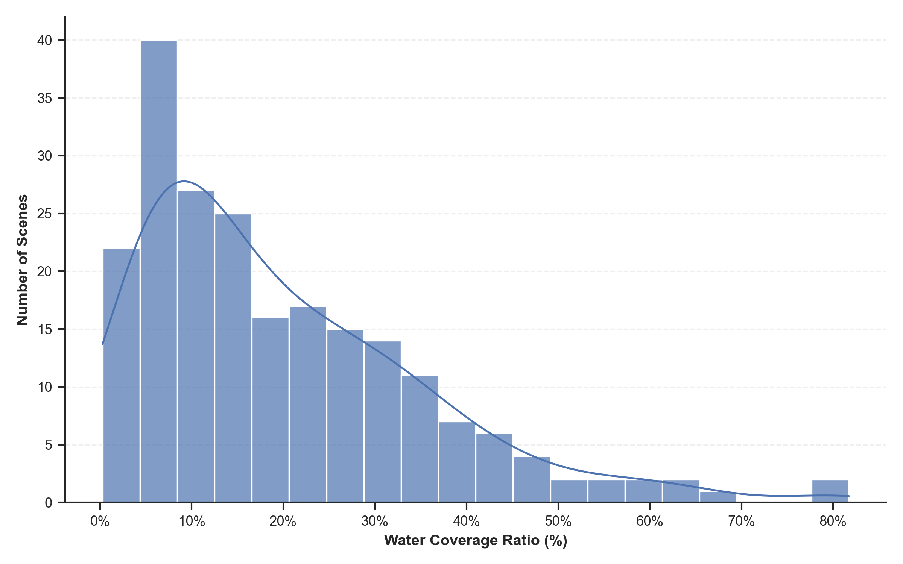
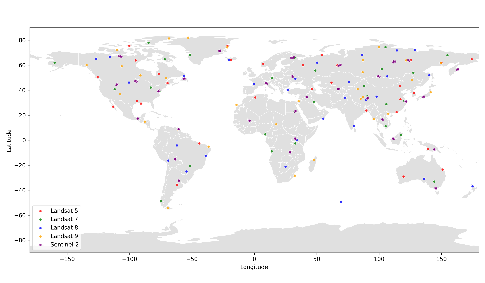
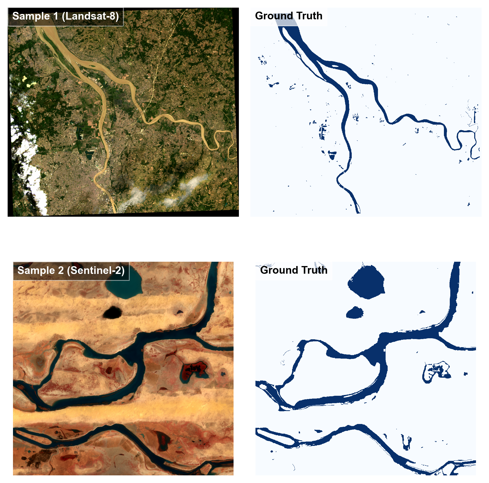

# Water_code
**water bodies dataset for deep learning**

### **--- Title**

Deep learning-based water bodies mapping using Landsat-5, 7, 8 , 9 images and Sentinel 2 images .

### **--- Content**

* Tutorial of remote sensing image acquisition and groud truth labeling.
* Tutorial of remote sensing data loader for deep learning.
* Tutorial of deep learning model building (take unet as example).
* Tutorial of deep learning model training and validation.

### **--- Ongoing image labeling**

* Number of labeled image reach to 215!! 🎉
* If you are interested in this propject, welcome to join us! 👏

## 📊 Dataset Description

This dataset focuses on multispectral water body segmentation, integrating optical imagery from multiple satellite platforms (**Landsat-5/7/8/9** and **Sentinel-2**) to ensure model robustness across different resolutions and sensors.

### 1. Statistical Overview
The dataset structure is analyzed in **Figure 1**, providing a dual-perspective on data composition:

- **(a) Dataset Composition (Left):** A nested donut chart illustrating the data source distribution.
    - **Outer Ring:** Represents the **Pixel Contribution (%)**. This reflects the total data volume used for training.
    - **Inner Ring:** Displays the explicit **Scene Count (N)**. 
    - *Insight:* Comparing the rings reveals sensor characteristics; for instance, Sentinel-2 may have fewer scenes (Inner) but contributes a significant number of pixels (Outer) due to high resolution or larger swath coverage.
- **(b) Class Balance (Right):** Shows the global ratio between Water and Non-water (Background) pixels, highlighting the class imbalance typical in remote sensing tasks.

  

  <em>Figure 1: (a) Nested donut chart showing pixel contribution (Outer) vs. scene count (Inner); (b) Global water vs. non-water pixel ratio.</em>

### 2. Data Diversity & Distribution
To evaluate generalization capability, the dataset includes scenes with varying water body sizes and geographical locations.

- **Water Coverage Distribution (Fig 2):** The histogram with a Kernel Density Estimation (KDE) curve shows the frequency of water coverage ratios. The distribution confirms a diverse mix of **small water bodies** (e.g., ponds, narrow rivers) and **large hydrological features** (e.g., lakes, oceans).
- **Geographical Distribution (Fig 3):** Samples are collected globally across **Asia, Europe, North America, South America, Africa, and Oceania**, ensuring no spatial bias towards a specific region.

  

  <em>Figure 2: Frequency distribution of water coverage ratios per scene.</em>

  

  <em>Figure 3: Global geographical distribution of the dataset scenes, color-coded by satellite sensor.</em>

<<<<<<< HEAD
### 3. Visual Samples
Each sample consists of a multispectral optical image and a pixel-level binary ground truth mask. 
=======
### 2. Sample Visualization
The dataset includes high-resolution multispectral images with corresponding binary water masks. All images are pre-processed (percentile stretching) for visualization.

- **Input:** Multispectral optical images (Visualized in RGB).
- **Ground Truth:** Binary masks where white represents water bodies and black represents the background.

  

  <em>Figure 3: Representative samples of optical images (Left) and their corresponding ground truth labels (Right).</em>

### 3. Geographical Distribution
>>>>>>> 16e230d20b8663419ea56684f0967d7a9d25827d

- **Preprocessing:** Images are visualized in **True Color (RGB)** using sensor-specific band combinations (e.g., Bands 4-3-2 for Sentinel-2/Landsat-8, Bands 3-2-1 for Landsat-5/7) and robust 2%-98% percentile stretching.
- **Ground Truth:** Binary masks where **White** indicates water and **Black** indicates background.

<<<<<<< HEAD
  

  <em>Figure 4: Representative samples. Left: True Color RGB images; Right: Ground Truth water masks.</em>

=======
  

  <em>Figure 5: Global geographical distribution of the dataset scenes, color-coded by satellite sensor .</em>

>>>>>>> 16e230d20b8663419ea56684f0967d7a9d25827d
### **---To do**
