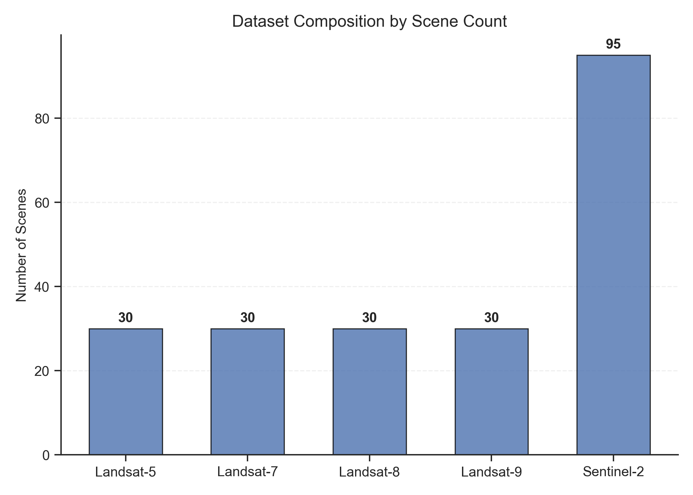
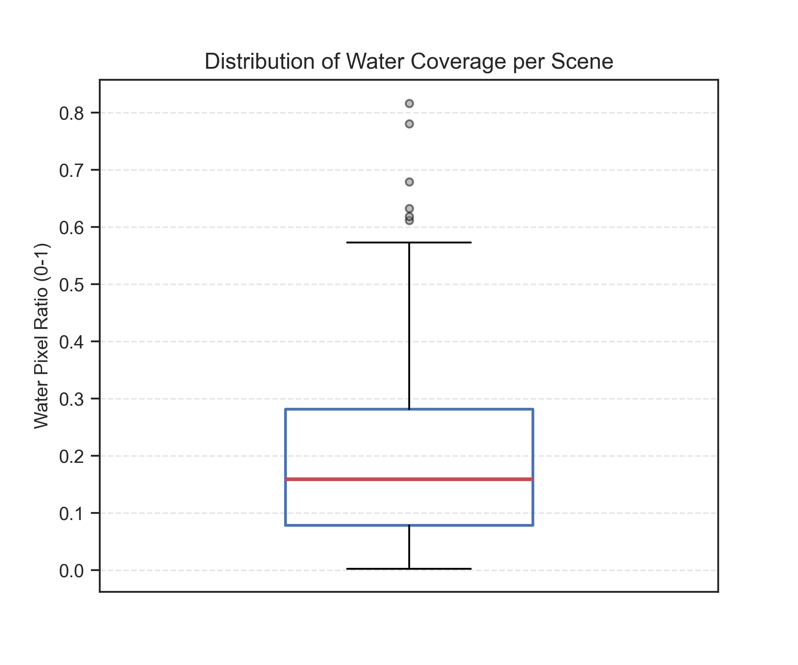
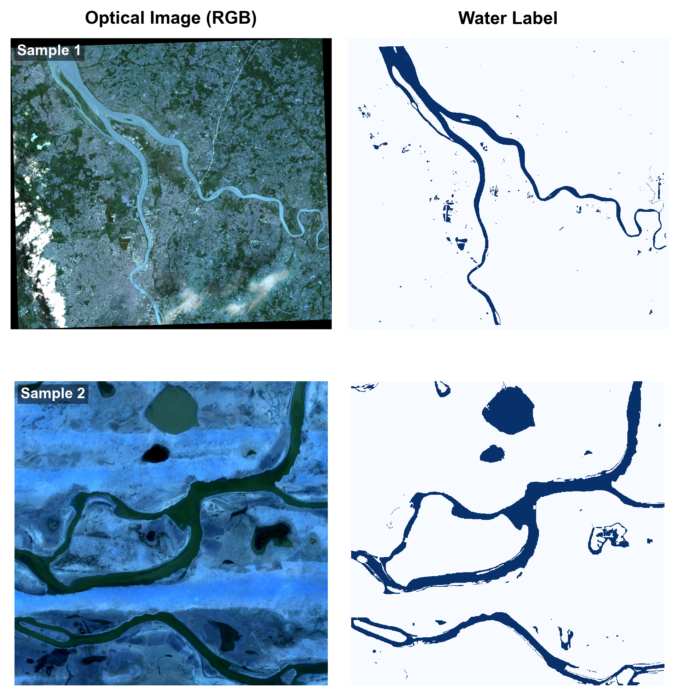

# Water_code
**water bodies dataset for deep learning**

### **--- Title**

Deep learning-based water bodies mapping using Landsat-5, 7, 8 , 9 images and Sentinel 2 images .

### **--- Content**

* Tutorial of remote sensing image acquisition and groud truth labeling.
* Tutorial of remote sensing data loader for deep learning.
* Tutorial of deep learning model building (take unet as example).
* Tutorial of deep learning model training and validation.

### **--- Ongoing image labeling**

* Number of labeled image reach to 215!! 🎉
* If you are interested in this propject, welcome to join us! 👏

## 📊 Dataset Description

### 1. Statistical Distribution
The dataset is composed of diverse scenes with varying water coverage ratios. 

- **Fig 1 (a)** illustrates the pixel-level contribution from each satellite platform.
- **Fig 1 (b)** shows the global class balance between water and non-water pixels.
- **Fig 2** provides the quantitative breakdown of scene counts per satellite sensor.
- **Fig 4** displays the variability of water coverage per image.

  

  <em>Figure 1: Pixel-level distribution (Left) and global class balance (Right).</em>

  

  <em>Figure 2: Quantitative breakdown of scene counts per satellite sensor.</em>

  

  <em>Figure 4: Distribution of water pixel ratios per scene.</em>

### 2. Sample Visualization
The dataset includes high-resolution multispectral images with corresponding binary water masks. All images are pre-processed (percentile stretching) for visualization.

- **Input:** Multispectral optical images (Visualized in RGB).
- **Ground Truth:** Binary masks where white represents water bodies and black represents the background.

  

  <em>Figure 3: Representative samples of optical images (Left) and their corresponding ground truth labels (Right).</em>

### 3. Geographical Distribution

To evaluate the generalization capability of segmentation models, samples were collected globally across various continents and climatic zones. 

- **Fig 5** depicts the geolocation of each image scene. 
- The dataset covers a wide range of hydrological environments, distributed across **Asia, Europe, North America, South America, Africa, and Oceania**.
- Different colors represent different satellite sensors, ensuring that the multi-source data is not spatially biased.

  

  <em>Figure 5: Global geographical distribution of the dataset scenes, color-coded by satellite sensor .</em>

### **---To do**
